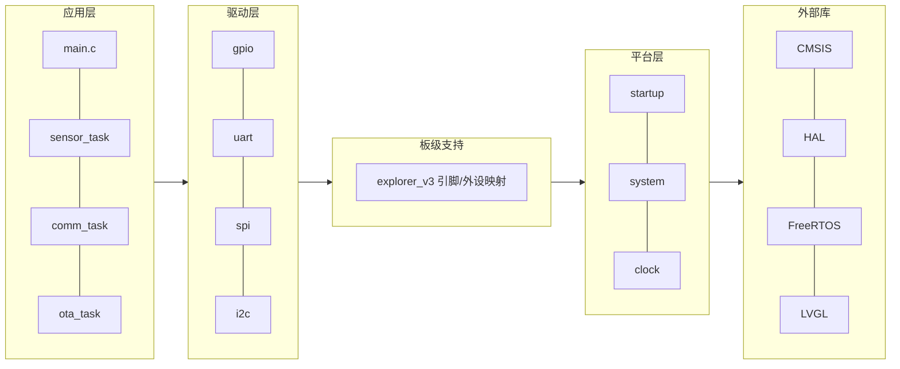
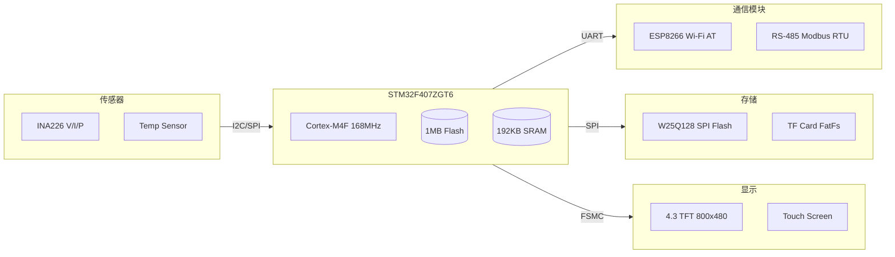
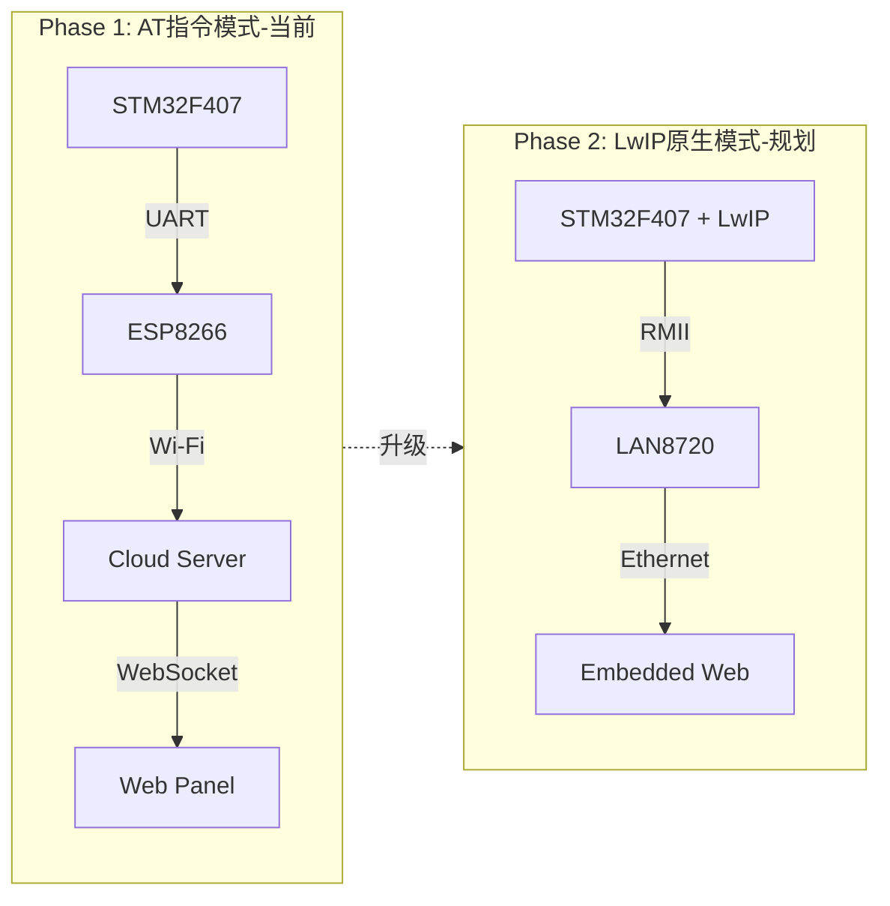
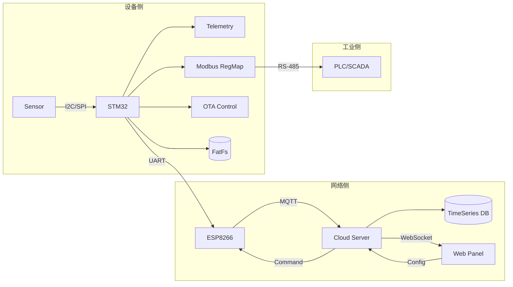
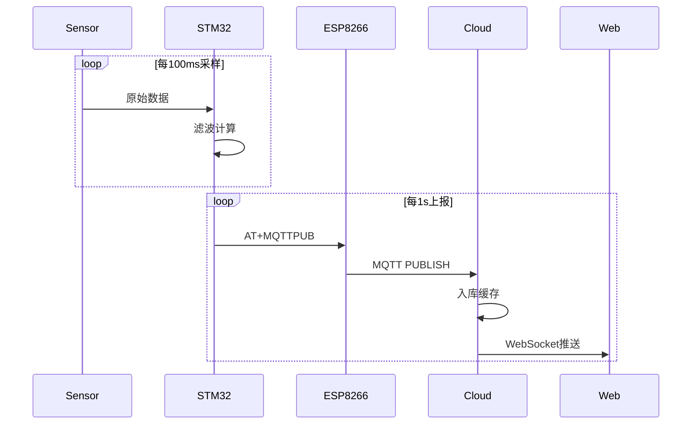
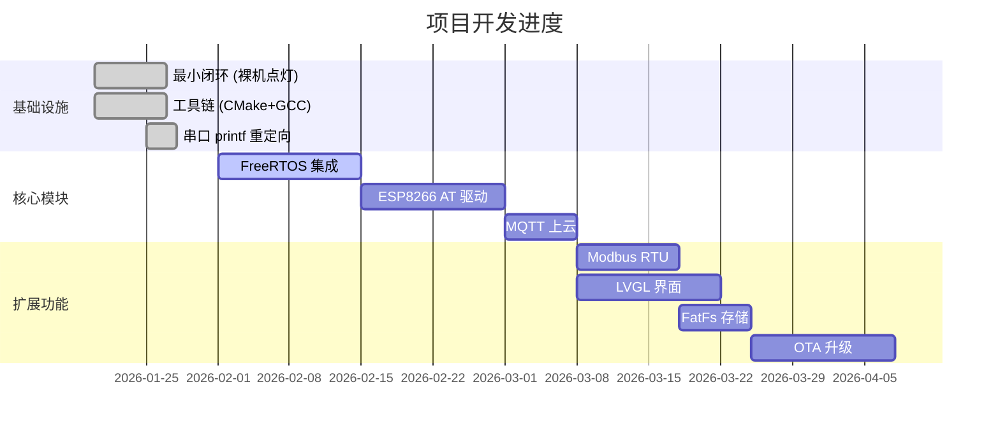

<div align="center">
  <h1>⚡ Smart Energy Terminal</h1>
  <hr/>
  <p>
    <b>智能能源监控终端</b> | 基于 <b>STM32F407ZGT6</b> + <b>FreeRTOS</b> + <b>ESP8266 AT</b> + <b>Modbus RTU</b> + <b>LVGL</b> + <b>FatFs</b> + <b>OTA</b>
  </p>
  <p>
    
    
    
    
  </p>
  <p>
    
    
    
    
  </p>
  <p>
    <sub>可靠通信 · 本地显示 · 外部存储 · 远程升级</sub>
  </p>
</div>

---

##  一、📖 项目简介

Smart Energy Terminal 是一款**面向工业场景的智能能源监控终端**，能够实时采集电压、电流、功率等能源数据，通过 Modbus RTU 协议与上位机/SCADA 系统通信，支持本地触摸屏显示和远程 OTA 固件升级。

### 🌟 项目亮点

| 亮点 | 说明 |
|:---:|:---|
| 🏗️ **工程化分层** | 平台/板级/驱动/应用清晰分层，便于协作与维护 |
| 🔌 **通信与协议** | ESP8266 AT + Modbus RTU 组合，覆盖工业通信常见场景 |
| 🖥️ **本地显示与存储** | LVGL 本地 UI + FatFs 外部存储，便于落地产品化功能 |
| 🔄 **远程升级** | 预留 OTA/Bootloader 路径，支持后续量产迭代 |

---

## 二、🏛️ 系统架构

### 软件分层架构



### 硬件连接架构



---

## 三、🔄 架构演进路线

本项目规划了**两阶段架构演进**，兼顾快速落地与技术深度：



| 对比项 | 第一阶段：AT 指令 | 第二阶段：LwIP |
|:---:|:---|:---|
| **定位** | 快速落地，验证业务 | 高性能，工业级 |
| **通信方式** | STM32 → UART → ESP8266 | STM32 内置 TCP/IP 协议栈 |
| **Web 面板** | 依赖云端服务器 | **内置 Web 服务器** |
| **吞吐量** | ~11KB/s (串口限制) | 10/100Mbps |
| **开发难度** | ⭐⭐ 入门级 | ⭐⭐⭐⭐⭐ 专家级 |
| **简历竞争力** | 标准 | **极高 (杀手锏)** |

> 📄 详细对比分析：[网络架构对比分析 (LwIP vs AT)](docs/架构设计/网络架构对比分析_LwIP_vs_AT.md)

---

## 四、📊 数据流设计

### 端到端数据流



### 实时显示时序



---

## 五、✨ 核心特性

| 特性 | 描述 |
|:---|:---|
| 🔌 **多参数采集** | INA226 高精度传感器，采集电压/电流/功率，滑动平均滤波 |
| 🌐 **双通道通信** | ESP8266 AT (Wi-Fi/MQTT) + Modbus RTU (RS-485) |
| 📊 **本地触摸屏** | LVGL 实时曲线、告警信息、参数配置，增量刷新 |
| ⚠️ **智能报警** | 过压/欠压/过流检测，继电器联动，阈值可配置 |
| 💾 **数据持久化** | SPI Flash + FatFs，30 天循环存储，掉电保护 |
| 🔄 **OTA 远程升级** | HTTP 下载，CRC32 校验，双分区回滚 |
| 🛡️ **系统可靠性** | IWDG 看门狗、PVD 掉电检测、任务栈监控 |

---

## 六、🎯 应用场景

<table>
<tr>
<td align="center">🏭<br/><b>工业配电</b><br/><sub>车间/产线监测</sub></td>
<td align="center">🏢<br/><b>楼宇能源</b><br/><sub>分户/分区计量</sub></td>
<td align="center">☀️<br/><b>光伏储能</b><br/><sub>发电量采集</sub></td>
<td align="center">🔬<br/><b>实验室</b><br/><sub>精密设备监控</sub></td>
<td align="center">📚<br/><b>学习项目</b><br/><sub>嵌入式综合实践</sub></td>
</tr>
</table>

---

## 七、📈 项目进度

> 🕐 更新时间：2026-02-06



| 模块 | 状态 | 说明 |
|:---|:---:|:---|
| 最小闭环（裸机点灯） | ✅ 完成 | GPIO 初始化 + 周期翻转 + 延时 |
| 工具链（CMake + GCC + OpenOCD） | ✅ 完成 | 跨平台交叉编译 |
| 串口 printf 重定向 | ✅ 完成 | `_write()` 重定向到 USART1 |
| FreeRTOS | 🚧 进行中 | 引入任务/队列/事件组 |
| ESP8266 AT | 📋 规划 | UART + DMA + IDLE + RingBuffer |
| MQTT/HTTP 上云 | 📋 规划 | MQTT 优先，HTTP 备选 |
| Modbus RTU | 📋 规划 | 从站，寄存器建模 |
| LVGL UI | 📋 规划 | TFT/触摸/局部刷新 |
| FatFs 存储 | 📋 规划 | W25Qxx + TF 卡 |
| OTA/Bootloader | 📋 规划 | 双分区 + 回滚 |

---

## 八、🛠️ 技术栈

### 硬件平台

| 组件 | 型号/规格 | 用途 |
|:---|:---|:---|
| **MCU** | STM32F407ZGT6 | Cortex-M4F, 168MHz, 1MB Flash, 192KB SRAM |
| **开发板** | 正点原子探索者 V3 | 板载 LAN8720 PHY (为 LwIP 升级预留) |
| **Wi-Fi** | ESP8266 | AT 指令模式，UART 通信 |
| **显示屏** | 4.3寸 TFT | 800×480，FSMC 8080 并口 |
| **存储** | W25Q128 + TF 卡 | SPI Flash 16MB + FatFs |
| **调试器** | CMSIS-DAP | SWD 接口 |

### 软件工具

| 工具 | 版本 | 用途 |
|:---|:---|:---|
| `arm-none-eabi-gcc` | 12.x+ | 交叉编译器 |
| `CMake` + `Ninja` | 3.20+ | 构建系统 |
| `OpenOCD` | 0.12+ | 烧录/调试 |
| `VS Code` | Latest | 编辑器 + Cortex-Debug |

---

## 九、🚀 快速开始

### 1️⃣ 构建

```bash
# 配置 + 编译
cmake -S firmware -B build/firmware-gcc -G Ninja \
  -DCMAKE_TOOLCHAIN_FILE:FILEPATH=%cd%/firmware/cmake/toolchain-arm-none-eabi.cmake
ninja -C build/firmware-gcc
```

或使用 VS Code 任务：`Firmware: Configure+Build (Ninja)`

### 2️⃣ 烧录

```bash
openocd -f interface/cmsis-dap.cfg -f target/stm32f4x.cfg \
  -c "program build/firmware-gcc/app.elf verify reset exit"
```

或使用 VS Code 任务：`Firmware: Flash (OpenOCD, CMSIS-DAP)`

### 3️⃣ 调试

使用 VS Code + Cortex-Debug 插件，配置已在 `.vscode/launch.json` 中提供。

> 💡 **提示**：连接不稳定时，将 `adapter speed` 调低到 `500`，并确保连接 `NRST` 引脚。

---

## 十、📁 目录结构

```
Smart_energy_terminals/
├── 📄 README.md
├── 📄 LICENSE
├── 📂 docs/                    # 项目文档
│   ├── 快速开始/
│   ├── 架构设计/
│   ├── 开发指南/
│   └── 模块文档/
├── 📂 external/                # 第三方库
│   ├── ST/                     # CMSIS + HAL
│   ├── FreeRTOS/               # (规划)
│   ├── LVGL/                   # (规划)
│   └── FatFs/                  # (规划)
├── 📂 tools/                   # PC 侧工具脚本
└── 📂 firmware/                # 固件工程
    ├── app/                    # 应用层入口
    ├── drivers/                # 外设驱动
    │   ├── gpio/
    │   ├── uart/
    │   ├── spi/
    │   └── comm/               # ESP8266 AT (规划)
    ├── boards/                 # 板级配置
    │   └── explorer_v3/
    ├── platform/               # 平台适配
    │   └── stm32f407/
    ├── common/                 # 通用工具库
    └── cmake/                  # 构建配置
```

### 分层约定

| 层级 | 职责 | 依赖 |
|:---|:---|:---|
| `app/` | 业务逻辑、任务编排 | 可依赖 RTOS |
| `drivers/` | 外设驱动封装 | 不依赖 RTOS |
| `boards/` | 板级引脚/外设映射 | 仅描述硬件事实 |
| `platform/` | 芯片级适配 (启动/时钟) | 与芯片强绑定 |
| `external/` | 第三方原始库 | 不修改，用补丁隔离 |

---

## 📚 文档索引

| 分类 | 文档 |
|:---|:---|
| **入门** | [文档索引](docs/README.md) · [启动流程动画](docs/快速开始/startup-animation.html) · [调试指南](docs/快速开始/调试指南.md) |
| **架构** | [硬件资源分配](docs/架构设计/硬件资源分配.md) · [网络架构对比 (LwIP vs AT)](docs/架构设计/网络架构对比分析_LwIP_vs_AT.md) |
| **开发** | [串口重定向](docs/开发指南/串口重定向.md) · [CMakeLists 详解](docs/开发指南/CMakeLists-详解.md) · [编码规范](docs/开发指南/编码规范.md) |
| **模块** | [FreeRTOS 集成](docs/模块文档/FreeRTOS集成指南.md) · [Modbus 协议](docs/模块文档/Modbus协议文档.md) · [OTA 升级](docs/模块文档/OTA升级协议.md) |

---

## 📜 License

本项目采用 [MIT License](LICENSE) 开源协议。

---

<div align="center">
  <sub>Made with ❤️ by <a href="https://github.com/Bertrand666">Bertrand</a></sub>
</div>
