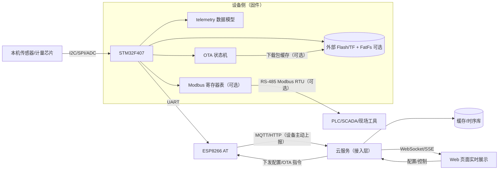
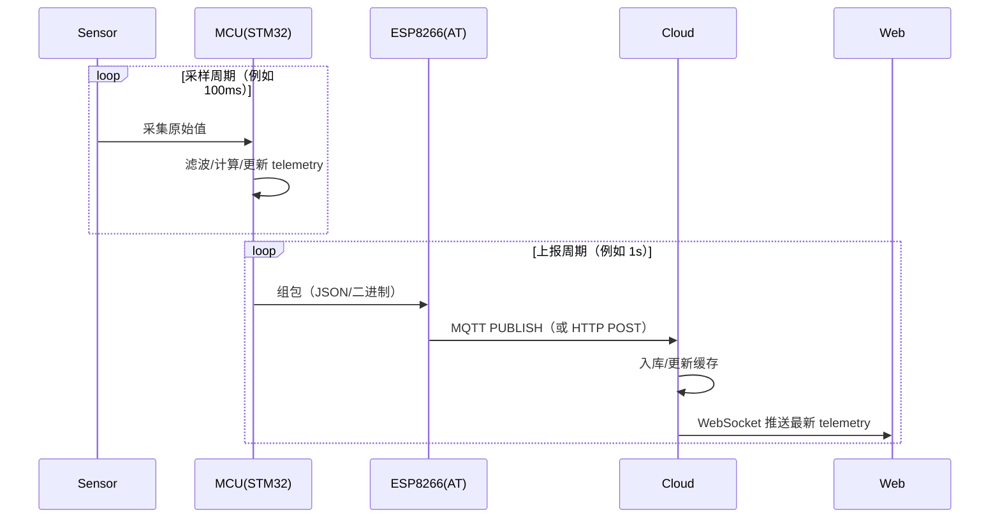

<div align="center">
  <h1>⚡ Smart Energy Terminal</h1>
  <hr/>
  <p>
    <b>智能能源监控终端</b> | 基于 <b>STM32F407ZGT6</b> + <b>FreeRTOS</b> + <b>ESP8266 AT</b> + <b>Modbus RTU</b> + <b>LVGL</b> + <b>FatFs</b> + <b>OTA</b>
  </p>
  <p>
    
    
    
    
  </p>
  <p>
    
    
    
    
  </p>
  <p>
    <sub>可靠通信 · 本地显示 · 外部存储 · 远程升级</sub>
  </p>
</div>

---

## 项目简介

Smart Energy Terminal 是一款面向工业场景的智能能源监控终端，能够实时采集电压、电流、功率等能源数据，通过Modbus RTU 协议与上位机/SCADA 系统通信，支持本地触摸屏显示和远程 OTA 固件升级。

## 项目亮点

- **工程化分层**：平台/板级/驱动/应用清晰分层，便于协作与维护
- **通信与协议**：ESP8266 AT + Modbus RTU 组合，覆盖工业通信常见场景
- **本地显示与存储**：LVGL 本地 UI + FatFs 外部存储，便于落地产品化功能
- **远程升级**：预留 OTA/Bootloader 路径，支持后续量产迭代

## ✨ 核心特性

| 特性                 | 描述                                                         |
| -------------------- | ------------------------------------------------------------ |
| 🔌 **多参数采集**     | 通过 INA226 高精度传感器采集电压、电流、功率，支持滑动平均滤波 |
| 🌐 **通信与协议**     | ESP8266 AT + Modbus RTU 组合，覆盖工业通信常见场景           |
| 📊 **本地触摸屏 GUI** | LCD 实时显示能耗曲线、告警信息，支持参数配置，增量刷新优化   |
| ⚠️ **智能报警**       | 过压/欠压/过流/过功率检测，联动继电器自动切断负载，支持阈值动态修改 |
| 💾 **数据持久化**     | SPI Flash 存储历史数据，支持 30 天循环覆盖，掉电保护 <0.1% 数据丢失 |
| 🔄 **OTA 远程升级**   | HTTP 接口上传固件，CRC32 校验，双分区安全升级，支持 Bootloader |
| 🛡️ **系统可靠性**     | 独立看门狗 (IWDG)、PVD 掉电保护、任务栈监控、故障自恢复      |
| 🌐 **Web 管理面板**   | 实时数据监控、历史曲线、参数配置、固件升级，支持 WebSocket 推送 |

## 🎯 应用场景

- 🏭 **工业配电监控** - 车间/产线电力参数实时监测
- 🏢 **楼宇能源管理** - 分户/分区电能计量与统计
- ☀️ **光伏/储能系统** - 发电量、用电量数据采集
- 🔬 **实验室电源监控** - 精密设备供电状态监测
- 📚 **嵌入式学习项目** - FreeRTOS + ESP8266 AT + Modbus 综合实践

## 项目进度

> 更新时间：2026-01-28

| 模块 | 状态 | 说明 |
|---|---|---|
| 最小闭环（裸机点灯） | 进行中 | GPIO 初始化 + 周期翻转 + 延时 |
| 工具链（CMake + GCC + OpenOCD） | 进行中 | 跨平台交叉编译 |
| HAL | 规划 | 手动移植/裁剪，仅引入所需外设 |
| RTOS（FreeRTOS） | 规划 | 引入任务/队列/事件组；按采集/通信/OTA 分层 |
| 联网（ESP8266 AT） | 规划 | UART + DMA + IDLE + RingBuffer；设备主动连云 |
| 上云（MQTT/HTTP） | 规划 | MQTT 优先（长连接、低开销）；HTTP 备选 |
| 协议（Modbus RTU） | 规划 | 作为现场/工业侧接口：寄存器建模、异常码、CRC |
| UI（LVGL） | 规划 | TFT/触摸/局部刷新 |
| 外部存储（Flash/TF + FatFs） | 规划 | W25Qxx + FatFs |
| OTA/Bootloader | 规划 | 下载校验 + 断点续传 + 双分区/回滚 |

## 技术栈

- MCU：STM32F407（Cortex-M4F）
- 当前阶段：Bare Metal（无 RTOS）
- 构建：CMake / Ninja / arm-none-eabi-gcc
- 烧录/调试：OpenOCD + Cortex-Debug（VS Code）
- 规划：FreeRTOS、ESP8266 AT、Modbus RTU、MQTT/HTTP 上云、WebSocket 实时推送、LVGL、FatFs、OTA/Bootloader、CAN

## 总体方案

本机传感器 + 云服务器 + Web 实时展示，采用 **工业侧标准接口 + 云侧遥测协议** 的组合：

- **本地/工业侧**：实现 Modbus RTU（从站）作为现场可对接接口（可选但非常加分）
- **上云/网页侧**：设备通过 ESP8266 作为客户端 **主动上报云端**（MQTT 优先，HTTP 备选），云端再通过 WebSocket 推送给 Web 页面

这样做的好处：

- 兼顾工业生态（PLC/SCADA/串口工具）与云端实时体验
- 设备主动连云，天然适配 NAT/无公网 IP 场景
- 便于接入 FreeRTOS 与 OTA（任务划分清晰、链路可观测）

### 端到端数据流图（推荐）



### 实时显示时序（MQTT + WebSocket）



### 1) 核心数据模型（建议）

先把“采集到的量”抽象为统一数据源（后续 Modbus/MQTT/本地显示都复用）：

- `telemetry`：电压/电流/功率/能量/温度等数值 + 时间戳 + 状态位（告警/传感器离线/校准状态等）
- `config`：阈值/采样周期/上报频率/设备 ID/联网参数等

### 2) FreeRTOS 任务划分（建议）

在 FreeRTOS 引入后，建议按“数据流”拆任务，避免业务逻辑散落在中断与驱动层：

- `sensor_task`：采集 + 滤波 + 生成 telemetry（固定周期）
- `comm_task`：对外通信（MQTT/HTTP 上报；可扩展命令下发）
- `modbus_task`（可选）：维护寄存器表与 RTU 协议栈（从站响应）
- `storage_task`（可选）：FatFs 写入历史数据/日志/升级包缓存
- `ota_task`：升级检查、下载、校验、切换、失败回滚

任务间推荐用 Queue/EventGroup，驱动层尽量保持“无 RTOS 依赖”。

### 3) OTA 升级策略（建议）

面向量产可靠性，建议实现：

- **下载校验**：CRC32（基础）/签名校验（进阶加分）
- **断点续传**：升级包可先落到外部 Flash/TF（FatFs），或分块写入升级分区
- **双分区/回滚**：Bootloader 根据镜像标志位选择启动；失败自动回滚到旧版本
- **版本管理**：防回退、升级过程状态上报（便于云端可视化）

## 🛠️ 硬件与开发环境

- 目标硬件：STM32F407ZGT6（Cortex-M4F，168MHz，1MB Flash / 192KB SRAM）
- 调试下载：CMSIS-DAP（SWD）
- 供电与接口：板载 3.3V/5V，支持 USB/UART/调试接口
- 主机环境：Windows 10/11（推荐）/ macOS / Linux

### 硬件平台

- 开发板：正点原子探索者 V3（STM32F407ZGT6）
- 联网（规划）：ESP8266（AT 指令，UART + DMA + IDLE + RingBuffer）
- 工业协议（规划）：Modbus RTU（从站）
- 显示（规划）：4.3 寸 TFT，800×480（竖屏），FSMC/8080 并口
- 外部存储（规划）：W25Q128（SPI Flash）+ TF（FatFs）
- 总线（规划）：CAN

###  开发工具

- 编译器：`arm-none-eabi-gcc`
- 构建系统：`CMake` + `Ninja`
- 烧录调试：`OpenOCD` + `Cortex-Debug`
- 编辑器：`VS Code`

## 文档

- 文档索引： [docs/README.md](docs/README.md)
- 串口重定向（printf）： [docs/串口重定向.md](docs/%E4%B8%B2%E5%8F%A3%E9%87%8D%E5%AE%9A%E5%90%91.md)

## 快速开始

> 建议先完成最小验证：**点灯闪烁稳定**（可选再加串口打印）。

### 1) 构建

```bash
cmake -S firmware -B build/firmware-gcc -G Ninja -DCMAKE_TOOLCHAIN_FILE:FILEPATH=%cd%/firmware/cmake/toolchain-arm-none-eabi.cmake
ninja -C build/firmware-gcc
```

也可以直接在 VS Code 里运行任务：

- `Firmware: Configure+Build (Ninja)`

### 2) 烧录（示例：OpenOCD）

```bash
openocd -f interface/cmsis-dap.cfg -f target/stm32f4x.cfg -c "transport select swd; adapter speed 500; init; reset halt; program build/firmware-gcc/app.elf verify reset exit"
```

也可以直接在 VS Code 里运行任务：

- `Firmware: Flash (OpenOCD, CMSIS-DAP)`

连接不稳定时的经验项：

- 将 `adapter speed` 调低到 `1000` 或 `500`
- 尽量连接 `NRST`

### 3) 调试（VS Code）

- 调试配置通常放在 `.vscode/launch.json`，使用 `Cortex-Debug + OpenOCD`
- 你可能需要按自己的调试器补齐 `configFiles` / `svdFile` 等

## 当前可运行内容（最小闭环）

当前固件已包含：

- LED 翻转（GPIO）
- 串口 `printf`（通过 `_write()` 重定向）

对应代码入口：

- 主循环：[firmware/app/src/main.c](firmware/app/src/main.c)
- `printf` 重定向：[firmware/app/src/retarget.c](firmware/app/src/retarget.c)
- UART 初始化/发送：[firmware/drivers/uart/uart.c](firmware/drivers/uart/uart.c)

> 如果你把日志接到 USB-TTL，常见是 USART1（PA9/PA10），波特率 115200（以代码为准）。

## MQTT 侧建议（上云主链路）

推荐把云端通信做成“设备主动上报”，并支持云端下发配置/OTA 指令：

- 上报频率：默认 1 Hz（Web 曲线足够平滑），采样频率可更高但要做聚合
- 传输层：MQTT 优先（低开销、易重连），HTTP 备选

示例（仅作建议，非强制）：

```text
topic: devices/{deviceId}/telemetry
payload: {"ts":1738195200,"v":230.1,"i":1.23,"p":283.2,"alarm":0}

topic: devices/{deviceId}/cmd
payload: {"type":"set_config","report_hz":1}

topic: devices/{deviceId}/ota
payload: {"type":"start","url":"https://.../fw.bin","crc32":"..."}
```

## 目录结构

> 说明：当前仓库以“目录骨架”为主，后续会逐步填充源码与文档。

```text
Smart_energy_terminals/
├─ README.md
├─ LICENSE
├─ docs/								项目文档（架构/硬件资源/协议/升级等），用于沉淀设计与约束
├─ external/							第三方依赖的“原始代码”统一放置（尽量不在此处写业务逻辑）
│  ├─ st/								ST 官方基础库
│  │  ├─ CMSIS/							CMSIS Core + Device（启动、中断、寄存器映射等最底层依赖）
│  │  │  ├─ Core/
│  │  │  └─ Device/
│  │  └─ STM32F4xx_HAL_Driver/			HAL 驱动库（可选；需要时手动裁剪引入）
│  │     ├─ Inc/
│  │     └─ Src/
│  ├─ FreeRTOS/							FreeRTOS（规划；后期引入）
│  ├─ FatFs/							FatFs（规划；后期引入）
│  └─ LVGL/								LVGL（规划；后期引入）
├─ tools/								PC 侧工具与脚本（烧录/打包/辅助工具）
└─ firmware/							固件工程本体（自研代码为主）
   ├─ app/								应用入口与业务编排（裸机 main / 后期 RTOS task 也在此）
   │  └─ inc/	
   |  └─ src/
   ├─ CMakeLists.txt
   ├─ cmake/							CMake 工具链文件、通用宏与构建封装
   ├─ linker/							链接脚本（.ld），描述 Flash/RAM 布局与段映射
   ├─ config/							工程/产品级配置头文件（后期集中管理开关与参数）
   ├─ platform/							
   │  └─ stm32f407/						平台适配层（与芯片强绑定）
   │     ├─ include/					平台层对外头文件（自研，避免再放一份 CMSIS）
   │     ├─ src/						平台层实现（如 clock、irq、tick 等封装）
   │     ├─ startup/					启动文件（向量表、复位入口等）
   │     └─ system/						系统初始化（时钟、FPU、SysTick 等）
   ├─ boards/							板级“真相源”（只描述硬件事实：引脚/外设占用/LED 有效电平等）
   │  └─ explorer_v3/
   │     ├─ include/
   │     └─ src/
   ├─ drivers/							驱动层（尽量不依赖 RTOS；上层通过接口调用）
   │  ├─ gpio/							GPIO 基础驱动/封装（点灯阶段会优先使用）
   │  ├─ uart/							UART 驱动（后期用于日志与 ESP8266）
   │  ├─ spi/							SPI 驱动（后期用于 W25Qxx 等）
   │  └─ comm/							通信相关驱动（规划：ESP8266 AT 协议解析/收发）
   ├─ common/							与芯片无关的通用库
   │  ├─ log/
   │  └─ utils/							小工具（ringbuffer/crc/delay 等）
   └─ tests/							测试（可选：host 侧单测/静态检查等）
```

### 分层约定（简版）

- `external/`：只放第三方“原始库”；若需要改动，优先用补丁/适配层方式隔离
- `platform/`：芯片级平台适配（启动/时钟/中断等），向上提供稳定接口
- `boards/`：仅放板级事实与薄适配（引脚/外设资源映射/句柄创建），不写业务状态机、不写 UI/协议
- `drivers/`：设备/外设驱动尽量纯 C，不依赖 RTOS；需要互斥/队列的策略放到 `app/`
- `app/`：应用入口与业务编排（当前裸机；后期可演进为 RTOS 任务/服务）
- `common/`：通用工具库，与芯片无关

> 建议（可选）：当通信/OTA/存储等模块增多后，可新增 `firmware/services/` 用于放置“与具体外设弱绑定的业务服务层”（例如 telemetry 管理、MQTT 客户端封装、OTA 状态机、参数配置管理），保持 `drivers/` 足够“薄”。

### 后续扩展建议（放置位置）

- 裸机点灯：`firmware/app/` + `firmware/drivers/gpio/` + `firmware/boards/` + `firmware/platform/`
- HAL（可选）：HAL 源码放 `external/st/STM32F4xx_HAL_Driver/`，工程内只编译用到的外设模块
- FreeRTOS：源码放 `external/FreeRTOS/`，适配与任务编排放 `firmware/app/`
- ESP8266 AT：底层 UART/DMA 在 `firmware/drivers/uart/`，协议收发/解析放 `firmware/drivers/comm/`
- Modbus RTU：协议状态机/寄存器模型建议放 `firmware/app/`（或后续新增 `services/` 目录）
- LVGL/FatFs：第三方放 `external/`，板级/驱动/适配放 `firmware/`（display/storage 等目录后续按需新增）

